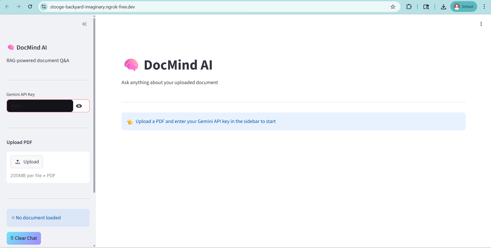
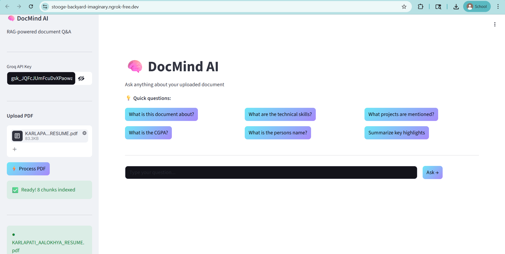

# 🧠 DocMind AI – RAG-based Document Q&A System

An AI-powered application that allows users to upload PDF documents and ask questions about their content using **Retrieval-Augmented Generation (RAG)**.

## 🚀 Features

* 📄 Upload any PDF document
* 🔍 Extract and process text using PyMuPDF
* 🧠 Intelligent question answering using RAG
* ⚡ Context-aware responses powered by LLMs
* 💬 Interactive chat interface with history
* 📊 Fast retrieval using vector database

## 🏗️ Architecture

1. PDF Upload
2. Text Extraction (PyMuPDF)
3. Text Chunking (LangChain)
4. Embeddings Generation
5. Vector Storage (ChromaDB)
6. Retrieval of relevant chunks
7. LLM generates final answer

## 🛠️ Tech Stack

* **Frontend:** Streamlit
* **Backend:** Python
* **LLM:** Gemini 2.0 Flash / Groq LLaMA3
* **Framework:** LangChain
* **Vector DB:** ChromaDB
* **Embeddings:** HuggingFace / Gemini
* **PDF Processing:** PyMuPDF
* **Deployment:** ngrok

## 📸 Demo

### 🏠 Home Page

### ⚡ Document Processing & Q&A

## ⭐ Acknowledgements

* LangChain
* HuggingFace
* Google Gemini
* Groq

✅ Add **badges (stars, tech logos)**
✅ Make it **top 1% GitHub level README** 🚀
